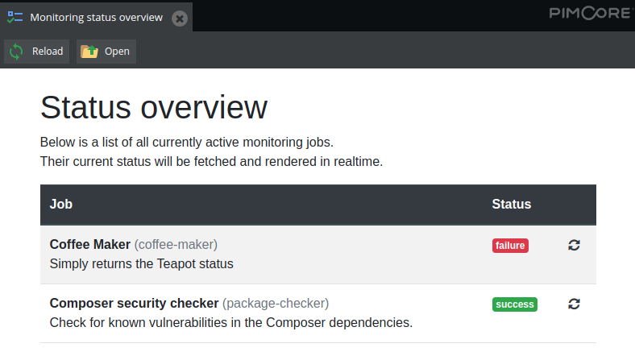

# Usage: fetch status responses 

## Authorization

You probably don't want to expose the status codes to just anyone.

By default the monitoring endpoint uses Symfony guard with the `WebserviceAuthenticator`.
So the call should be performed with an API key.

The Installer will create a "monitoring" user with a random API key (64 characters).

The API key can be added as HTTP header (or if your monitoring tool doesn't support header configuration, you can pass it as query string, however this is not the preferred method).
> The recommended way of passing API Key for webservice is through HTTP header X-API-Key however you can still use query parameter method

(quoted from the [Pimcore docs](https://pimcore.com/docs/pimcore/6.7/Development_Documentation/Web_Services/index.html))

## Configure your monitoring software

Next step is to configure your monitoring software to schedule HTTP requests to the provided endpoints.
The returned status code can trigger an alarm in your monitoring software.

For example:
- daily call to check vulnerabilities in your composer packages
- check every 4 hours how long it's been since the last time the sitemap was generated (if less than 24hours, return status 200)
- ... 

Success:


Failure:


## Console commands instead of HTTP requests

Optionally you could let the server perform the `monitoring:job:details` command 
and process the command exit code instead of the HTTP request. 
This would not require authentication, but your monitoring software has to support this.

_Note_: add the `--quiet` flag to suppress the detailed output

```shell
$ php bin/console monitoring:job:details package-checker --quiet

# print the exit code of the command (0 = success)
$ echo $?
0
```

```shell
$ php bin/console monitoring:job:details coffee-maker --quiet

# print the exit code of the command (0 = success)
$ echo $?
129
```

## Overview page

An overview page is added to give a quick glimpse of the status of the active jobs.
It's available under the route `monitoring/overview` (which will need an active backoffice session, or an API key).
Or available as an extra item in the "Tools" menu in the Pimcore interface.



